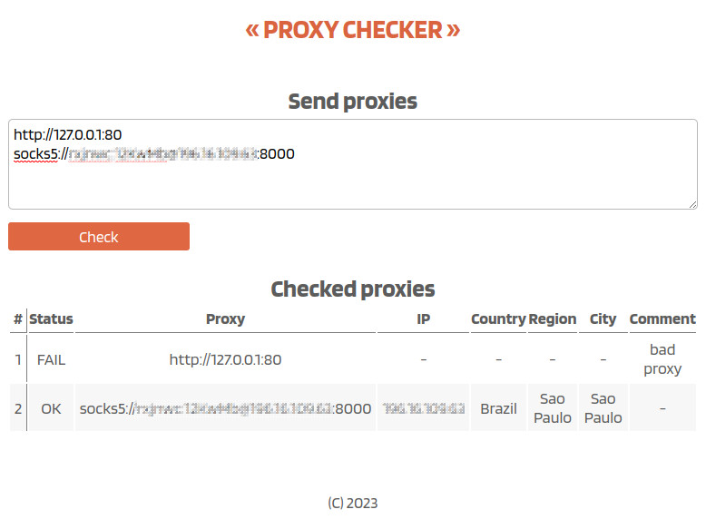

# API Proxy Checker

## Directories

---

**./configs/conf.toml** - configuration

**./data/geo-db.bin** - geo DB

**./docs** - OpenAPI

## Build/Run

---

**build/run**

```sh
 make build
 ```

``` sh
./apiproxychecker
```

```
http://localhost:30122
```

**run only**

``` sh
make run
```

```
http://localhost:30122
```

## Interface

---

>

---